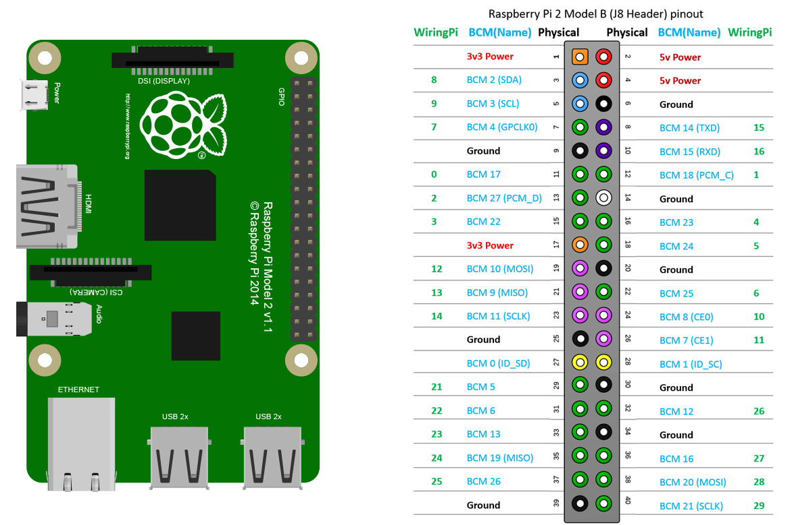

# SPADCam

## Troubleshooting
The folder SPADCam is a Python virtual environment which has all the correct libraries installed. To activate it, run `source SPADCam/bin/activate`

If there is an issue with virtualenv not being on the $PATH (e.g. you get the error `bash: virtualenv: command not found` when running virtualenv), try running `PATH=/home/uwgraphics/.local/bin:$PATH`

If you're getting an error related to the Arducam that's something like "can't find/access /dev/video0", make sure that the ribbon cable is plugged in correctly (side with text on it should face towards USB ports at the Pi end and towards the camera (so you can see the text if you can see the camera lens) at the camera end) and make sure the pi has been restarted since it was connected.

When trying to install numpy (necessary for ArduCamDepthCamera library, but weirdly not installed automatically with it), I ran into the issue described here: https://github.com/numpy/numpy/issues/16012. The fix mentioned there (`sudo apt-get install libatlas-base-dev`) worked to fix the issue for me

To connect an I2C depth sensor directly to the pi, you need to make the following connections: 

GND on sensor (black wire on qwiic) -> GND on Pi

3.3V on sensor (red wire on qwiic) -> 3.3V on Pi

SDA on sensor (blue wire on qwiic) -> BCM2 (SDA) on Pi

SCL on sensor (yellow wire on qwiic) -> BCM3 (SCL) on Pi

## Resources
[Arducam Depth Camera Documentation](https://docs.arducam.com/Raspberry-Pi-Camera/Tof-camera/TOF-Camera/)